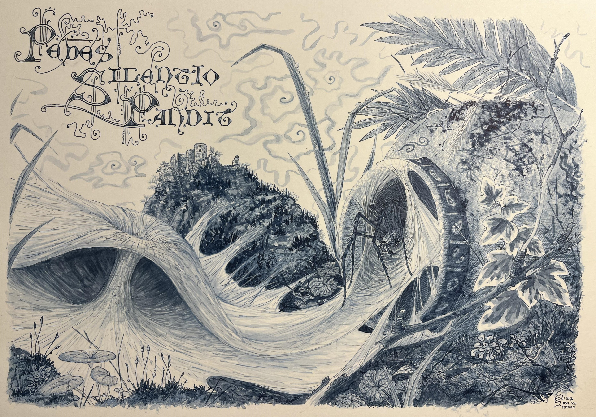
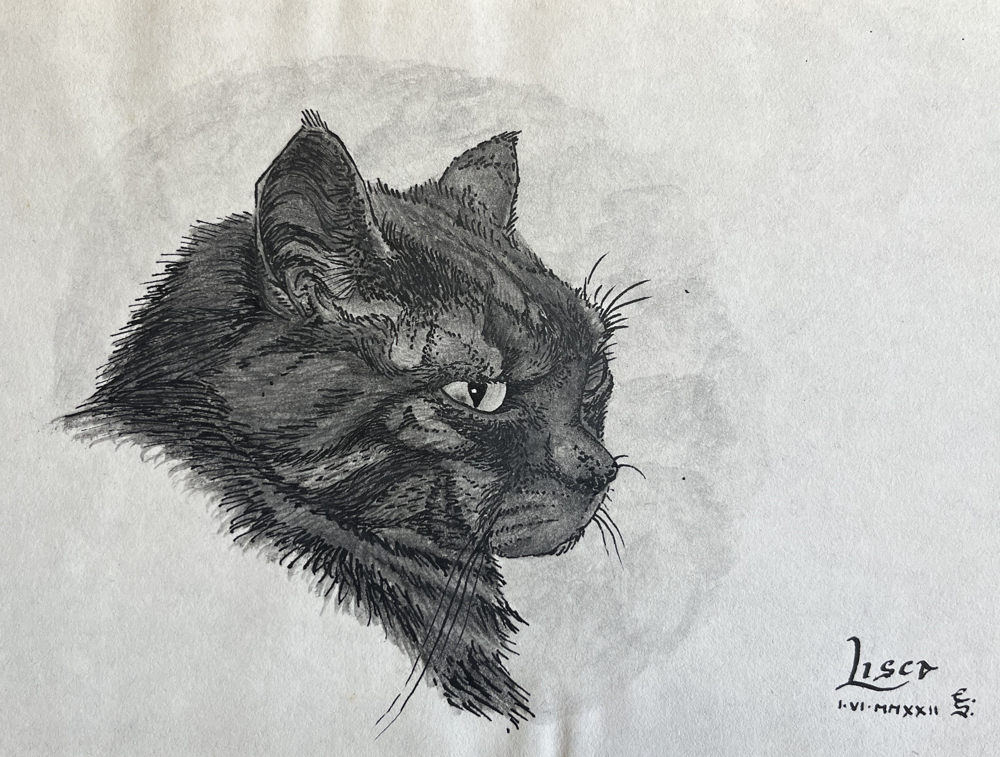
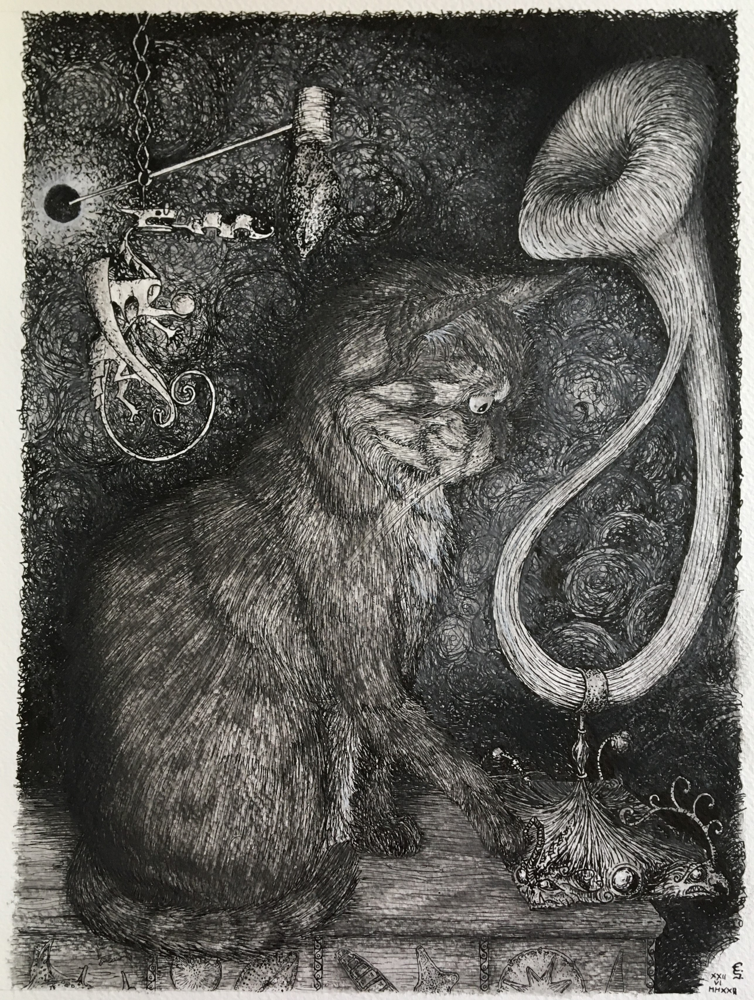

# Drawings and Paintings

## 2025-2026

{width=100%}

**Pedes Silentio Pandit -** 21/08/2025

Blue ink and water on A4 paper.

*The title is Latin and translates as "It [the spider] silently stretches its legs".*

## 2021-2022

{width=70%}

**Lisca's Portrait -** 1/06/2022

Black ink and water-soluble graphite pencils on A5 paper.

---

{width=70%}

**Lisca as the Catification of Physics -** 21/06/2021

Black ink, charcoal and water-soluble graphite pencils on A4 paper.